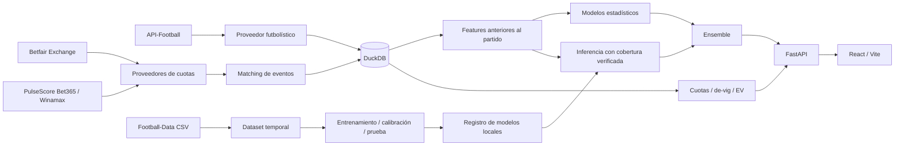

# Arquitectura activa

`backend/app/domain` define fixtures, observaciones, mercados, cuotas, configuración y salidas de modelos. Los adaptadores HTTP viven en `providers/`; ninguna estructura JSON específica del proveedor sale del adaptador.

`repositories/` guarda datos normalizados y snapshots. `services/` construye features, calidad/confianza, análisis, matching y rankings. Los modelos reciben `Features`, sin cliente HTTP, claves ni precios. `learning/` comparte el contrato de features entre dataset e inferencia.

DuckDB utiliza una conexión protegida por un bloqueo y **un solo proceso/worker**. Los lotes de importación históricos tienen transacciones; una importación fallida hace rollback. No hay Redis, Celery ni PostgreSQL en la aplicación activa.

La aplicación conserva snapshots de predicciones y precios. Las selecciones suspendidas se eliminan de la vista actual mediante snapshots de disponibilidad, sin borrar su historial. El emparejamiento exige equipos, competición, proximidad horaria y ausencia de ambigüedad; guarda aliases e identificadores por proveedor/casa.

La aplicación se inicia y se detiene manualmente. Mientras está abierta, el programador interno comprueba cada 30 segundos qué trabajo vence. Existe un ciclo diario persistente para **partidos y análisis** y otro para actualizar CSV. Los refrescos de fútbol se serializan; si se solicita hoy durante un trabajo de otra fecha, queda en cola. No hay tareas de Windows instaladas ni actividad con la aplicación detenida. El script de actualización puntual solo ejecuta su worker cuando el usuario lo solicita.

El histórico y los modelos se revisan al abrir y diariamente con la aplicación abierta. El reentrenamiento automático se ejecuta cuando cambia la revisión del histórico, falta un modelo o caduca. El entrenamiento se orquesta desde un hilo de trabajo y cada modelo puede utilizar todos los procesadores disponibles (`threads: auto`); DuckDB comparte esa capacidad y el servidor puede seguir atendiendo consultas. Windows utiliza prioridad normal. Los artefactos se publican mediante un puntero reemplazado de forma atómica, después de validar su recarga. Después se recalculan las predicciones y rankings de la jornada bajo el mismo bloqueo que el refresco de datos; el progreso no termina hasta aplicar la nueva versión. La primera predicción prepartido registrada para Performance se conserva. El apagado normal de Uvicorn espera al aprendizaje; el comando **Detener MatchLab** finaliza los procesos del proyecto, incluidos los workers, para liberar sus recursos inmediatamente. Un entrenamiento interrumpido antes de publicar no sustituye el modelo vigente.

El frontend recibe exclusivamente los contratos de la API. Hay rutas Today, Top Picks, Goals, Corners, Odds, Match Detail, Model Lab, Performance y Settings. El sondeo de la interfaz lee caché local; no implica una petición al proveedor por cada componente.

Los servicios se enlazan a localhost. Se comprueban Host y Origin en mutaciones, se restringe CORS y se evitan credenciales en logs y respuestas. Betfair tiene una lista explícita de operaciones de lectura. El código del stack anterior se ha retirado; sus datos locales no se migran ni se publican automáticamente.
